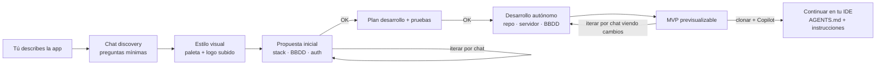

# Forge Chat Composer — Visión y diseño (Fase 6.0)

> **Objetivo**: pasar de un panel de control "paso a paso" a una experiencia **chat-first**
> tipo V0/Bolt: el usuario describe la app en lenguaje natural, Forge pregunta lo imprescindible,
> propone arquitectura, genera el plan, construye de forma autónoma y muestra un **MVP
> previsualizable** sobre el que el usuario itera **por chat mientras ve los cambios**.

## Flujo

## Reglas de producto (decisión del usuario)

1. **Logo**: SOLO se permite **subir** un logo. **No** se genera desde la herramienta.
   - Si se sube un logo, Forge infiere la paleta/estilo aproximado a partir de él.
   - Si el usuario especifica el estilo explícitamente, se respeta por encima de lo inferido.
   - Si no hay logo ni estilo explícito → se usa el estilo por defecto.
2. **UI por defecto**: catálogo de componentes **shadcn/ui**; **Material 3** como referencia alternativa.
3. **Previsualización**: el chat debe permitir ver el resultado (preview DEV) e **iterar
   mientras se visualizan los cambios** (cada iteración regenera la preview).
4. **Guardrails** (heredados): nada de merge fuera de flujo, no tocar `main` sin aprobación,
   secrets nunca expuestos, el desarrollo autónomo genera PR y preview, no deploy directo.

## Modelo de datos

- `ComposerSession` (nuevo): `status` (discovering → proposal → planning → building → preview → done/blocked),
  `messages` (JSON), `spec` (JSON), `proposal` (JSON), `plan` (JSON), `projectId?`, `logoUrl?`,
  `stylePref?`, `palette?` (JSON), `error?`.
- En `planning`/`building` se enlaza a un `Project` + `WorkSession` (reutiliza el flujo autónomo existente).

## Subfases del MVP

- **6.1 Discovery**: chat multi-turno que hace preguntas mínimas (nombre, propósito, repo,
  login, single/multi-usuario, estilo/paleta/logo) y produce un `spec` estructurado.
- **6.2 Propuesta**: a partir del `spec`, Forge propone stack/BBDD/auth/hosting y confirma o itera.
- **6.3 Plan + gates**: genera plan de desarrollo y pruebas; aprobación explícita antes de construir.
- **6.4 Build autónomo**: crea repo (GitHub API), app + env (Coolify API), lanza WorkSession,
  genera preview.
- **6.5 Iteración por chat**: ver preview, pedir cambios, ver cambios aplicados.
- **6.6 Handoff IDE**: `AGENTS.md` / `.github/copilot-instructions.md` para seguir con Copilot.

## Decisiones abiertas

- **BBDD real**: aprovisionar Postgres vía Coolify o usar externa (pendiente).
- **Logo**: análisis de colores en cliente (canvas) para inferir paleta; sin almacén de ficheros en el MVP.
